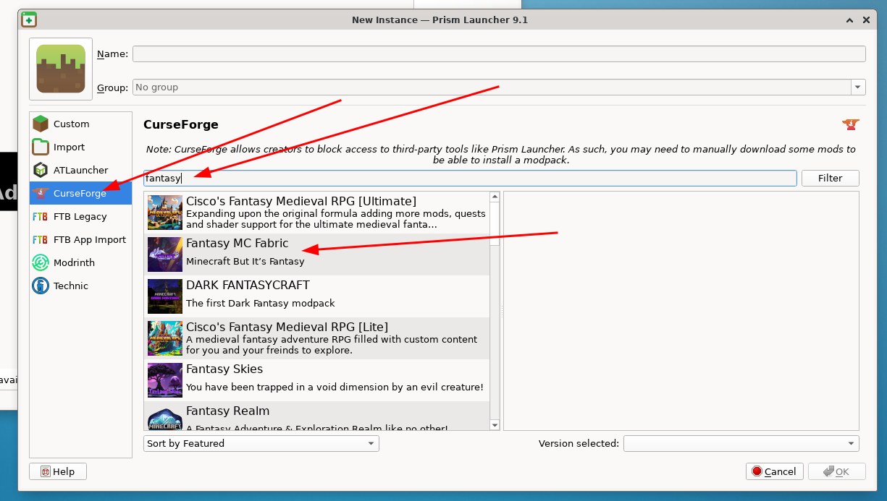

# Fantasy MC Fabric

Link: https://pixeldreamstudios.net/modpacks

How to get Fantasy MC Fabric working on linux.

This is how to install the server and client on Fedora 41 and it will probably work for other distros.

The problem is two parts 
a) The shipped libflfx.so doesn't work on Fedora 41
b) The you need a launcher that lets you use native libraries. 

If your client install crashes with a SIGSEGV in libglfw.so then you need GLFW 3.4 or greater
```
Current thread (0x00007fbf8c02c570):  JavaThread "Render thread" [_thread_in_native, id=158743, stack(0x00007fbf93100000,0x00007fbf93200000)]

Stack: [0x00007fbf93100000,0x00007fbf93200000],  sp=0x00007fbf931fda10,  free space=1014k
Native frames: (J=compiled Java code, j=interpreted, Vv=VM code, C=native code)
C  [libglfw.so+0x22574]
```

## Java
1. Visit https://adoptium.net/installation/linux/
2. Follow instructions to add repo
3. Install Java 17 `dnf install temurin-17-jdk`

## Install the Server

### Install Fantasy Fabric MC
1. Create a new directory for your server.
2. Visit curseforge to get the server pack (https://www.curseforge.com/minecraft/modpacks/fantasy-minecraft-fabric)
3. Select "Files"


4. Select the version you would like to download
5. Select the "Additional Files" and download the server zip into your new directory


6. Unzip the download `unzip fantasymc_fabric_1.20.1_2.9.8a_server_pack.zip`
7. Set execute perms on start.sh `chmod u+x start.sh`
8. Edit variables.txt and set JAVA to your temurin binary `JAVA=/usr/lib/jvm/temurin-17-jdk/bin/java`
9. Start the server `start.sh`
10. Agree to terms and wait for it to download and startup

## Client

### Install a new GLFW library
1. Download GLFW 3.4 from https://www.glfw.org/
2. Unzip the download `unzip glfw-3.4.zip`
3. `cd glfw-3.4`
4. Edit `CMakeLists.txt` in your fav editor
5. Enable shared libraries and turn off Wayland by changing
`option(BUILD_SHARED_LIBS "Build shared libraries" OFF)` to `option(BUILD_SHARED_LIBS "Build shared libraries" ON)`
and change `cmake_dependent_option(GLFW_BUILD_WAYLAND "Build support for Wayland" ON "UNIX;NOT APPLE" OFF)` to `cmake_dependent_option(GLFW_BUILD_WAYLAND "Build support for Wayland" OFF "UNIX;NOT APPLE" OFF)`
6. Generate the make files by running `cmake .`
7. Build the library `make`
8. Install the library `sudo make install`
9. Check `/usr/local/lib64/` for `libglfw.so`. If its there you are good to go

### Install Prism 
1. Install the Prism launcher  https://prismlauncher.org/download/
2. Select add an instance. 
3. Select "curseforge on the left"
4. Search for "fantasy"
5. Select "Fantasy MC Fabric"



6. Let it download
7. Download the mods that Prim cannot


8. I skipped the optional voice chat
9. Edit the instance


10. Got to Settings and make sure your java installation is for Temurin
 


11. Go to workarounds
 


12. Check "Native libraries"
13. Check the GLFW and openal libs
14. Make sure GLFW library path is for your newly built GLFW `/usr/local/lib64/libglfw.so`

 

15. Launch the instance